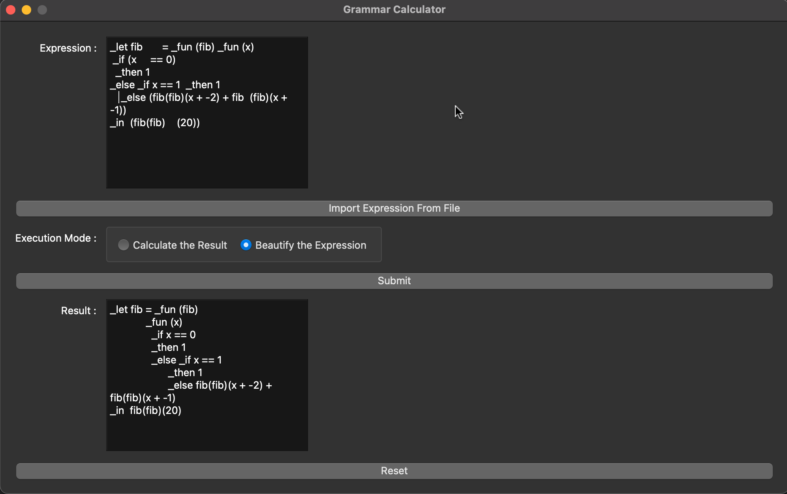
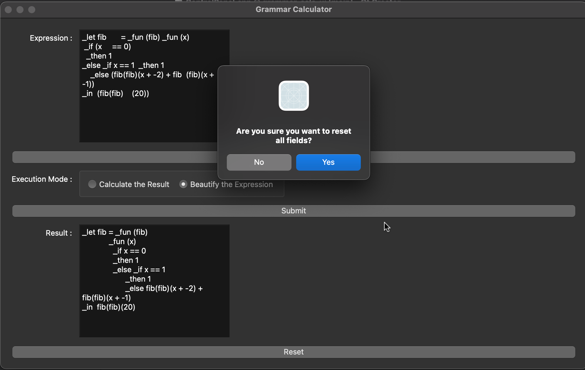

# What is the Grammar Calculator?

This is a C++ calculator program that can handle expressions with a predefined grammar, and is built using Qt C++. 


For example, it can calculate a function call with variable.
```text
# Expression
_let fib = _fun (fib)
             _fun (x)
               _if x == 0
               _then 1
               _else _if x == 1
                     _then 1
                     _else fib(fib)(x + -2) + fib(fib)(x + -1)
_in  fib(fib)(20)

# Result
10946
```

# How to Run the Program

Open `grammar-calc-ui.pro` in Qt Creator


# How to Use the Calculator

## Get to Know the Grammar

- Number: `8`, `-7`, ...
- Add: `<expression> + <expression>`
- Multiply: `<expression> * <expression>`
- Variable: Alphabetic words, `x`, `var`, ...
- Let: `_let x = 5 _in x + 11`, ...
- Bool: `_true` & `_false`, ...
- If: `_if x == 1 _then 2 _else 3`, `_if _true _then 1 _else 2`, ...
- Comparison: `<expression> == <expression>`
- Function: `_fun(x) x + 8`, ...
- Call the function: `(_fun(x) x + 8)(1)`, ...

### Import Expression From Local Files

### Calculate the Result

- Click `Import Expression From File`
- Import [test_expression.txt](test_expression.txt)
- Choose `Calculate the Result` 
- Click `Submit`
- The calculated result will be displayed in the result area


### Beautify the Expression

- Add unnecessary parenthesis or extra blank spaces or change the alignment / formatting of the imported expression a little bit
- Choose `Beautify the Expression`
- Choose `Submit`
- Now you get the beautified result



## Reset

### Confirmation

- Click `Reset`



### No

- Close the reset dialog window, nothing changes
  
### Yes

- Reset every field

## Handle Invalid Input

Expected results:
- Clear the last result
- Pop up an dialog, displaying the runtime error message

### Example 1

- Calculate `- 7`


### Example 2

- Calculate `8 +`

